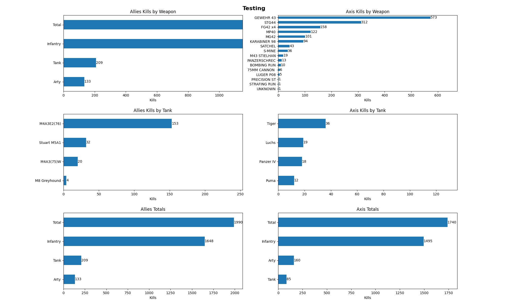
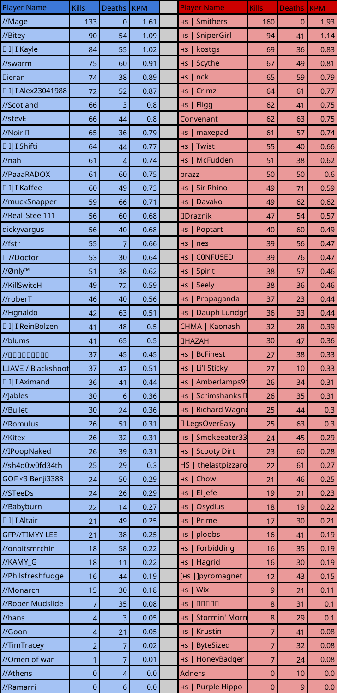

# Overview
It is gross, but the initial version was just slapted together one day never refined and then some features added on. The intent of making it a rest api is to be able to call it from a discord bot so i would not be responsible for creating the graphs... never got around to adding it to the bot


# Endpoints
Currently there are four endpoints
- /rcon-url/chart
```json
{
    "gameboard": "https://espt-rp-stats.hlladmin.com/#/gamescoreboard/21683",
    "title": "ESPT vs SYN"
}
```
- /rcon-url/table
```json
{
    "gameboard": "https://espt-rp-stats.hlladmin.com/#/gamescoreboard/21683",
    "title": "ESPT vs SYN"
}
```
- /hlu/chart
```json
{
    "logs": "https://cdn.discordapp.com/attachments/1117563211739312269/1163125372913717429/icfsyn1015_log.txt",
    "title": "FLL vs SYN"
}
```
- /hlu/table
```json
{
    "logs": "https://cdn.discordapp.com/attachments/1117563211739312269/1163125372913717429/icfsyn1015_log.txt",
    "title": "FLL vs SYN"
}
```


The rcon ones expect a gameboard as input it will go and download the stats. The HLU expect a discord file link to the HLU log file. It will download the log and parse out all the kills. Then it tries to classify each of the kills to a side by weapon type and creates the graphs.

# Outputs
Chart


Table

